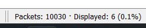

# Laporan Resmi Praktikum Jarkom Modul 1 2023

Repository in *Bahasa*

**Topik :**

Wireshark & Crimping

**Identitas :** 

Kelompok F07 -
Jaringan Komputer (F) </br>
*Insitut Teknologi Sepuluh Nopember*

 **Members :**
| Name                              | Student ID | Initials  |
| ----------------------------------|------------|:---------:|
| Arfi Raushani Fikra               | 5025211084 |   AF      |
| Rafi Aliefian Putra Ramadhani     | 5025211234 |   RR      |

## Permasalahan
> Detail Soal Praktikum yang diberikan beserta solusi penyelesaian 
### Soal 1 (Addressing)
> Solved by AF

#### Pertanyaan
User melakukan berbagai aktivitas dengan menggunakan protokol FTP. Salah satunya adalah mengunggah suatu file.
<ol type="a">
    <li>
    Berapakah sequence number (raw) pada packet yang menunjukkan aktivitas tersebut?
    </li> 
    <li>
    Berapakah acknowledge number (raw) pada packet yang menunjukkan aktivitas tersebut? 
    </li>
    <li>
    Berapakah sequence number (raw) pada packet yang menunjukkan response dari aktivitas tersebut?
    </li>
    <li>
    Berapakah acknowledge number (raw) pada packet yang menunjukkan response dari aktivitas tersebut?
    </li>
</ol>

#### Penyelesaian
Untuk menjawab soal ini, terdapat 2 pembagian kasus, dimana bagian pertama membahas tentang request aktivitas pengunggahan file untuk menjawab poin a dan b, sedangkan bagian kedua membahas tentang response terhadap aktivitas tersebut untuk menjawab poin c dan d.

Bagian Pertama : 

***a. Berapakah sequence number (raw) pada packet yang menunjukkan aktivitas tersebut?***

***b. Berapakah acknowledge number (raw) pada packet yang menunjukkan aktivitas tersebut?***

Pada display filter di file capture-nya (di dalam Wireshark), dapat memasukkan kueri sebagai berikut
```R
ftp contains "STOR"
```
Yang mana, melalui perintah "STOR" ini berarti melakukan pengunggahan file ke FTP server. Diperoleh hasil sebagai berikut :


Berikutnya, dapat melakukan klik dua kali pada paket tersebut atau melihat pada jendela khusus yang menampilkan detail paketnya. Setelah itu, klik pada bagian `Transmission Control Protocol` untuk mendapatkan `sequence number (raw)` dan `acknowledgment number (raw)` pada proses request pengunggahan file-nya. Untuk lebih jelasnya, dapat dilihat pada gambar berikut :


Sehingga diperoleh jawaban untuk poin `a. 258040667` dan `b. 1044861039`

Bagian Kedua :

***c. Berapakah sequence number (raw) pada packet yang menunjukkan response dari aktivitas tersebut?***

***d. Berapakah acknowledge number (raw) pada packet yang menunjukkan response dari aktivitas tersebut?***

Adapun, untuk poin c dan d, kita perlu mencari paket data yang menjadi *response* dari permintaan paket sebelumnya. Paket data *response* ini bisa berada di bawahnya, atau dapat ditandai dengan adanya kesamaan nama file yang diunggah. Pada soal ini, file yang diunggah memiliki nama yaitu `c75-GrabThePisher.zip`, maka dapat dicari paket *response* yang terkait, seperti pada gambar berikut :


Pada paket *response* tersebut, dapat melakukan hal yang sama yaitu membuka detail paketnya dan melihat `sequence number (raw)` dan `acknowledgment number (raw)`-nya di bagian `Transmission Control Protocol`. Dapat dilihat pada gambar berikut :


Sehingga diperoleh jawaban untuk poin `c. 1044861039` dan `d. 25040696`

</br>

### Soal 2 (Stream)
> Solved by AF

#### Pertanyaan
Sebutkan web server yang digunakan pada portal praktikum Jaringan Komputer!

#### Penyelesaian
Untuk mencari web server seperti yang diminta soal, kita dapat melakukan `follow HTTP Stream` terhadap paket yang menggunakan protokol HTTP di dalam pcap file yang telah disediakan.


Setelah itu akan tampak hasil stream-nya berisikan informasi termasuk web servernya, seperti pada gambar berikut :


Sehingga didapat informasi server dari portal praktikum Jaringan Komputer yakni `gunicorn`.

</br>

### Soal 3 (Analysis)
> Solved by RR

#### Pertanyaan
Dapin sedang belajar analisis jaringan. Bantulah Dapin untuk mengerjakan soal berikut:
<ol type="a">
    <li>
    Berapa banyak paket yang tercapture dengan IP source maupun destination address adalah 239.255.255.250 dengan port 3702?
    </li>
    <li>
    Protokol layer transport apa yang digunakan?
    </li>
</ol>    

#### Penyelesaian
***a. Berapa banyak paket yang tercapture dengan IP source maupun destination address adalah 239.255.255.250 dengan port 3702?***

**Query Wireshark :**

Pertama-tama melakukan pencarian protocol yang digunakan oleh `port 3702` agar filtering soal dapat dilakukan dengan sempurna. 
```R
(tcp.port || udp.port == 3702) 
```

Dapat dilihat bahwa protokol yang dimiliki oleh `port 3702` adalah `UDP`

Kemudian setelah menemukan protokol port 3702, langkah selanjutnya yaitu mencari kondisi filter sesuai soal, sebagai berikut :
```R
(ip.src == 239.255.255.250 && udp.port == 3702) || (ip.dst == 239.255.255.250 && udp.port == 3702)
```
Sintaks kueri filter `src` maupun `dst` memiliki kesamaan arti yaitu untuk menentukan direction atau arah dari id.

Hasil untuk `soal 3 poin a` adalah sebagai berikut :


Lebih jelasnya 


Jawaban terletak pada informasi `Displayed`. Sehinnga jawabannya adalah `21`

***b. Protokol layer transport apa yang digunakan?***
#### Penyelesaian
Karena telah diketahui menggunakan kueri `(tcp.port || udp.port == 3702)` maka hasil yang muncul untuk layer yang digunakan adalah `UDP` 

</br>

### Soal 4 (Addressing)
> Solved by AF

#### Pertanyaan
Berapa nilai checksum yang didapat dari header pada paket nomor 130?

#### Penyelesaian
Untuk mencari nilai checksum dari suatu paket data, kita dapat melihat detail pada header paketnya. Pada soal, diminta untuk mencari pada paket nomor 130. Berikut isi detail paket 130 yang bersumber dari file pcap untuk nomor 4.


Didapat nilai Checksum dari `Paket 130` adalah `0x18e5`

</br>

### Soal 5 (Analysis)
> Solved by RR

#### Pertanyaan
Elshe menemukan suatu file packet capture yang menarik. Bantulah Elshe untuk menganalisis file packet capture tersebut.
<ol type="a">
    <li>
    Berapa banyak packet yang berhasil di capture dari file pcap tersebut?
    </li>
    <li>
    Port berapakah pada server yang digunakan untuk service SMTP?
    </li>
    <li>
    Dari semua alamat IP yang tercapture, IP berapakah yang merupakan public IP?
    </li>
</ol>

#### Penyelesaian
Pada soal 5 tidak terdapat link netcat (nc), namun terdapat file `zippppfileee.zip` selain file `pcap`. File `zippppfileee.zip` ini memiliki access secara protected, yang mengharuskan mencari password melalui file `pcap` yang diberikan. 


Password dicari dengan cara melakukan klik pada paket 3 ataupun 4 yang merupakan paket ber-protokol `TCP` kemudian melakukan `Follow TCP Stream`. Dan password ditemukan dengan kondisi yang tidak beraturan di dalam paket tersebut seperti berikut :


Kemudian, sesuai perintah bahwa diharuskan untuk di `Decode` pada `Base64`. Dan setelah decode, password telah berhasil didapatkan dengan isi password yaitu `5implePas5word`

Setelah Password didapatkan, selanjutnya file `zippppfileee.zip` di-unzip menggunakan password yang didapat, dan akan muncul directory `s3crett/connect.txt`. Isi dari txt tersebut berisikan alamat netcat untuk menjawab soal.

***a. Berapa banyak packet yang berhasil di capture dari file pcap tersebut?***

Isi dapat dilihat secara langsung tanpa menggunakan kueri filter, namusn jika ingin tahu kueri filter nya dapat menggunakan kueri 
```R
frame.number
``` 
Dan hasilnya 


Terlihat bahwa paket yang berhasil di capture oleh file pcap adalah pada `Packets` atauapun `Displayed` sebanyak `60`

***b. Port berapakah pada server yang digunakan untuk service SMTP?***

Untuk melihat port yang digunakan oleh `smtp`, alangkah baiknya kita sort/filter terlebih dahulu dengan menggunakan kueri filter 
```R
smtp
```

untuk melihat hanya paket `smtp` yang ditampilkan. Setelah itu klik pada salah satu paket dan lihat port nya pada informasi `Transmission Control Protocol`


Hasilnya adalah Service SMTP berada pada `port 25` 

***c. Dari semua alamat IP yang tercapture, IP berapakah yang merupakan public IP?***

Private IP merupakan alamat IP yang dimanfaatkan dalam kondisi tertentu dalam sebuah jaringan lokal. pada pcap terdapat pada port `10.10.1.4` , `192.168.1.1.` dan `10.10.1.20`. 

Dan untuk Public IP sendiri merupakan IP yang bisa diakses langsung oleh internet. Terletak selain ip diatas dan merupakan jawaban penyelesaian soal yaitu pada IP `74.53.140.153`


</br>

### Soal 6 (Addressing)
> Unsolved (Revisi)

#### Pertanyaan
Seorang anak bernama Udin Berteman dengan SlameT yang merupakan seorang penggemar film detektif. sebagai teman yang baik, Ia selalu mengajak slamet untuk bermain valoranT bersama. suatu malam, terjadi sebuah hal yang tak terdUga. ketika udin mereka membuka game tersebut, laptop udin menunjukkan sebuah field text dan Sebuah kode Invalid bertuliskan "server SOURCE ADDRESS 7812 is invalid". ketika ditelusuri di google, hasil pencarian hanya menampilkan a1 e5 u21. jiwa detektif slamet pun bergejolak. bantulah udin dan slamet untuk menemukan solusi kode error tersebut.

#### Penyelesaian
Dari informasi yang diberikan dalam soal:

1. Kita dapat mengumpulkan semua huruf kapital (kecuali "SOURCE ADDRESS") yang ada pada soal dan membentuk kata "SUBTITUSI".

2. Kata "SOURCE ADDRESS" menggunakan huruf kapital semua.

3. Pada soal terdapat angka 7812.

4. Terdapat informasi a1, e5, u21.

Berdasarkan informasi ke-3, kita mencoba untuk mencari paket dengan nomor 7812 dan menemukan alamat sumber (source address) dari paket tersebut :


Selanjutnya, berdasarkan informasi ke-1, kita dapat mencoba menggantikan alamat IP dengan huruf sesuai dengan kata "SUBTITUSI".

Informasi ke-4 menyebutkan bahwa kunci (key) dari cipher adalah 0, 

```txt
104.18.14.101
↓  ↓  ↓  ↓  ↓  ↓    
10 4  18 14 10 1
↓  ↓  ↓  ↓  ↓  ↓    dilakukan SUBTITUSI
J  D  R  N  J  A
```

Sehingga Jawaban dari permasalahan Soal 6 adalah `JDRNJA`

</br>

### Soal 7 (Addressing)
> Solved by AF

#### Pertanyaan
Berapa jumlah packet yang menuju IP 184.87.193.88?
#### Penyelesaian
Untuk mengetahui jumlah paket yang menuju ke IP 184.87.193.88, kita dapat menuliskan kueri berikut pada display filter
```R
ip.dst == 184.87.193.88
```
Diperoleh hasil sebagai berikut. 




Dapat dilihat terdapat `6 paket` dari hasil filtering / `Displayed`

</br>

### Soal 8 (Filtering)
> Solved by AF
#### Penyelesaian
Untuk hanya mengambil semua protokol paket yang menuju port 80 dan jika terdapat lebih dari 1 port, maka diambil berdasarkan urutan abjad, kita dapat menggunakan kueri sebagai berikut.
```R
tcp.dstport == 80 || udp.dstport == 80
```
Dengan begini kita akan mendapatkan paket-paket dengan protokol yang menuju port 80, seperti pada gambar berikut :


</br>

### Soal 9 (Filtering)
> Solved by RR

#### Pertanyaan
Berikan kueri filter sehingga wireshark hanya mengambil paket yang berasal dari alamat 10.51.40.1 tetapi tidak menuju ke alamat 10.39.55.34!

#### Penyelesaian
Dikarenakan yang diminta oleh soal adalah kueri filter saja tanpa menggunakan `pcap` maka kueri filter nya sebagai berikut :
```R
ip.src == 10.51.40.1 && ip.dst != 10.39.55.34
```
Perbedaan terdapat pada `comparison operator` karena keadaan 2 menyatakan bahwa tidak menuju ke alamat tersebut maka menggunakan `!=`

</br>

### Soal 10 (Stream)
> Solved by AF

#### Pertanyaan
Sebutkan kredensial yang benar ketika user mencoba login menggunakan Telnet

#### Penyelesaian
Untuk mencari kredensial ini, kita dapat melakukan `follow TCP Stream` pada paket-paket dengan protokol TELNET. Setelah itu melakukan pindah antar stream untuk menemukan kredensial yang tepat (Untuk soal ini, kami melakukan pendekatan uji coba tiap stream). Diperoleh hasil berikut pada perpindahan stream ke-3.


diperoleh kredensial dalam format `[username]:[password]` yaitu `dhafin:kesayangannyak0k0`

</br>

## Kendala 
Kami merasa masih belum terbiasa dengan penggunaan wireshark, terutama dalam pembacaan detail paket hasil capture, dan kami akan terus improve dalam hal ini.

</br>

*Terima kasih kepada semua Asisten atas kesempatan untuk Praktikum Modul 1 Jaringan Komputer 2023*
